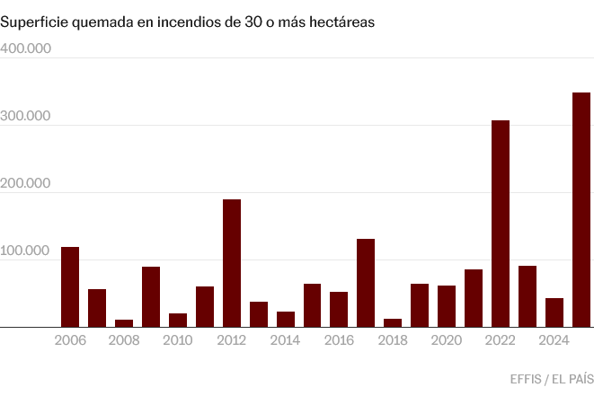

# IberFire: característiques que envolten els incendis a la Península Ibèrica
### Visualització de dades

#### Esther Ruano Hortoneda
#### Gener 2026

Exploració del dataset [IberFire](https://ekoizpen-zientifikoa.ehu.eus/documentos/6813ec1ee6f3433a41370134?utm_source=chatgpt.com) d'acord amb les qüestions plantejades a la [primera part de la pràctica](https://github.com/EstherRH00/IberFire/blob/main/EstherRuanoHortoneda-Part1.pdf).

## Diccionari de variables
* `x_index, y_index`: dimensió; valors enters dels intervals [0, 1187], [0,919] respectivament, que representen les coordenades x i y.
* `is_spain`: dimensió; booleà que representa si és Espanya o no.
* `is_fire, is_near_fire`: fet; booleans per indicar si hi ha foc dins la cel·la o es troba a prop de foc.
* `x_coordinate, y_coordinate`: dimensió; valors reals, corresponents a les coordenades EPSG:3035.
* `is_sea, is_waterbody`: dimensió; booleans que indiquen si el quilòmetre quadrat és aigua i/o mar.
* `AutonomousCommunities`: dimensió; enter [0,19] que indica la comunitat autònoma.
* `CLC_2006/2012/2018_<...>`: dimensió; proporcions entre 0 i 1 que indiquen el percentatge del quilòmetre quadrat que ocupa cada una de les explotacions dins de cada una de les tres etiquetes del projecte [CORINE Land Cover](https://land.copernicus.eu/en/products/corine-land-cover) als anys 2006, 2012 i 2018.
* `aspect_1…8,NODATA`: dimensió; proporcions entre 0 i 1 que indiquen la proporció del terreny que té cada inclinació.
* `elevation<…>, slope<...>, roughness<...>`: dimensió; valors relacionats amb el desnivell i inclinació del terreny.
* `dist_to<...>`: dimensió; mitjanes i desviacions de les distàncies a carreteres, rius i vies de tren en cada un dels quadrats de la graella.
* `is_natura2000`: dimensió; booleà que indica si forma part de la xarxa [Natura 2000](https://www.miteco.gob.es/es/biodiversidad/temas/espacios-protegidos/red-natura-2000.html).
* `popdens_20<....>`: dimensió; densitat depoblació en persones per quilòmetre quadrat per cada un dels anys entre 2008 i 2020.
* `is_holiday`: booleà que indica si és festiu o no.
* `t2m/RH/surface_pressure/total_precipitation/wind_speed/wind_direction_<....>`: dimensió; valors relatius al temps que ha fet en cada posició en cada dia concret: temperatura, humitat, pressió, precipitacions, direcció i velocitat del vent. Inclou mitjanes, rangs, mínims i màxims.
* `FAPAR`: dimensió; Fracció de Radiació Activa Absorvida Fotosintèticament
* `LAI, NDVI`: dimensió; índex de vegetació i fullatge per metre quadrat.
* `LST`: dimensió; Temperatura a la Superfície de la Terra, en graus Kelvin.
* `SWI_001/005/010/020`: dimensió; percentatge d’aigua al sol a 1, 5, 10 i 20 centímetres sota terra, respectivament.
* `FWI`: fet derivat; Fire Weather Index, columna afegida a la segona versió del dataset per ser utilitzada com a baseline model.

## 1. On i quan s’han produït incendis a Espanya entre 2007 i 2024? 
Primerament veurem on s’han produit incendis al llarg del temps, utilitzant la variable is_fire. 

## 2. Quines condicions meteorològiques i de vegetació precedeixen un incendi? 
Per respondre-la, entendrem quines característiques hi havia al terreny els cinc dies abans de l'incendi: 
* LAI
* NDV
* LSDT
* SWI_001/005/010/020
* t2m/RH/surface_pressure/total_precipitation/wind_speed/ wind_direction_<....>. 

Per entendre-ho millor, permetrem filtrar per tipus de terreny segons CORINE Land Cover i Natura 2000. Així veurem si hi ha algun patró al sol que ens pot indicar risc d’incendi.

Dels anys que inclou el dataset, 2022 va ser el que presenta més incendis. Per reduir el volum de dades, d'ara en endavant, ens centrarem en aquest ([font](https://elpais.com/clima-y-medio-ambiente/2025-08-18/los-datos-apuntan-ya-al-peor-ano-de-incendios-en-espana-en-tres-decadas-tras-un-agosto-brutal.html)).

### Primerament estudiem segons si forma part, o no de la [Xarxa Natura 2000](https://www.miteco.gob.es/es/biodiversidad/temas/espacios-protegidos/red-natura-2000.html)